# Phone Status to Discord
This is a node.js discord bot that can create a realtime updated embed with information of your phone. 

We achieve this using a express.js http server that listen to requests from our phone and updates the embed with that info

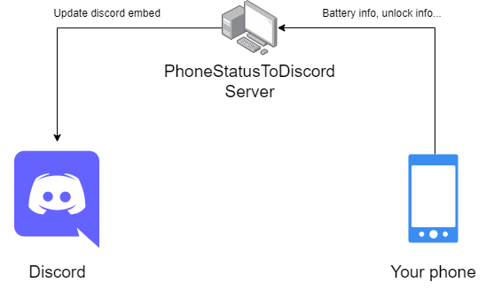

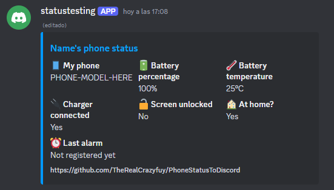

## What do we need
- 💻 A pc/server where we can allow external connections
- 📱 An Android phone
- 💡 Basic network knowledge

## How to set up
### On the server
1. Clone the repository
   
   `git clone https://github.com/TheRealCrazyfuy/PhoneStatusToDiscord`

2. Configure the `.env` file with your bot token, name, phone model and set the port you want to use
> [!WARNING]  
> You will need to allow external connections to the port you set
3. Install all the modules
   `npm install`

4. Set up the bot slash commands
   `node deployCommands.js`

5. Start the bot
   `node index.js`

Once the bot is running, we must add it to our server and execute the `/createembed` command on the channel we want the embed

### On the phone
1. Head to the Play Store and download [Automate](https://play.google.com/store/apps/details?id=com.llamalab.automate)
2. Open the app and agree to the warning
3. Download the backup file [here](https://github.com/TheRealCrazyfuy/PhoneStatusToDiscord/raw/main/Automate_tasks.bak)
4. Press on the 3 top-left lines to open the menu, go to settings and import the backup
   

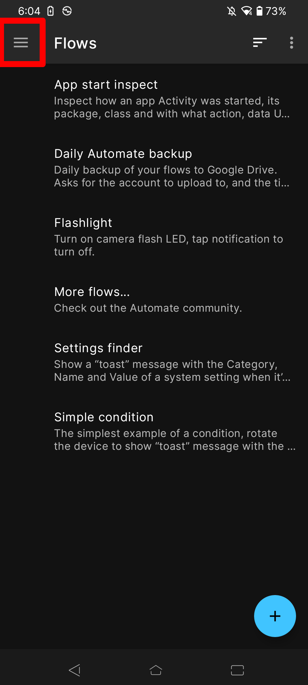
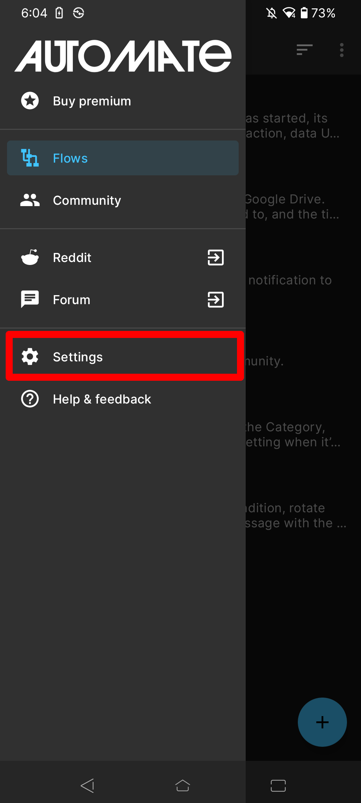
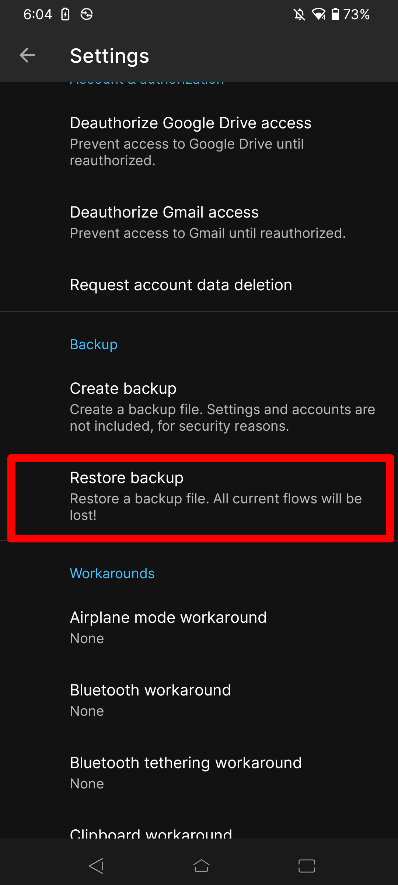
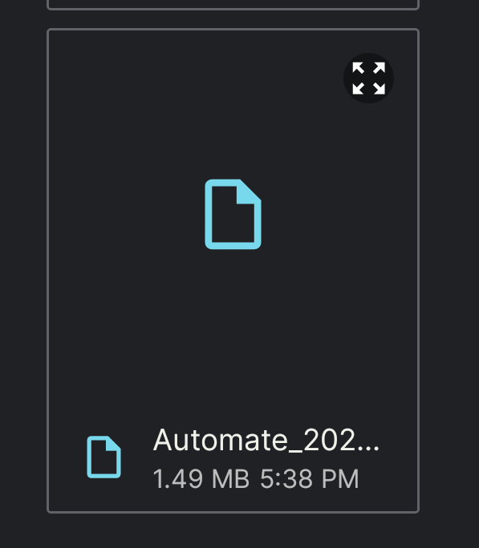
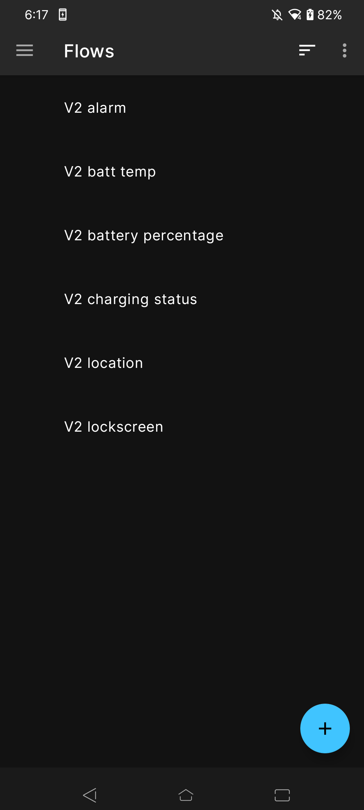

5. Once we have the workloads imported we can enter them and edit their http request block to point to our server ip and port
> [!WARNING]  
> If you enabled http authentication you will need to add it inside the request block

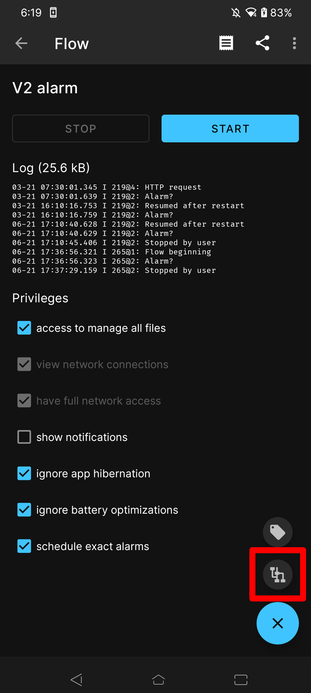
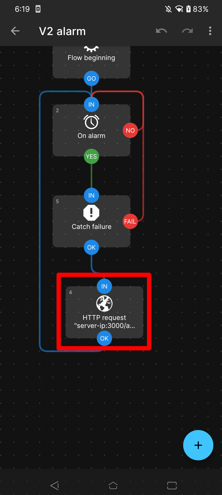
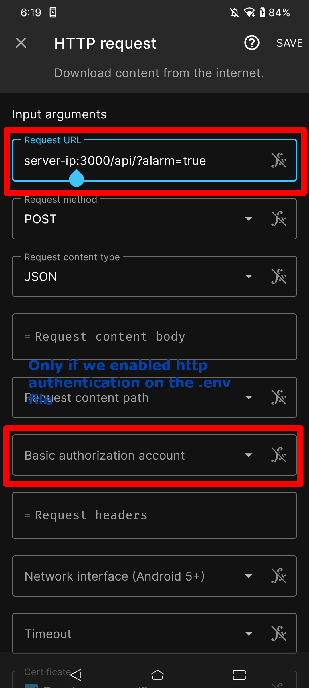

1. We start all of the workloads, allowing all the permissions asked by the program

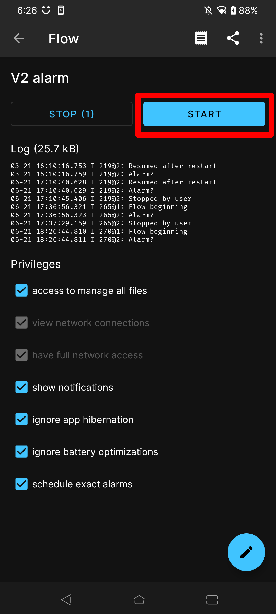

If you did everything right, the bot should be working now

## Common problems

## Credits
- [Discord.js](https://github.com/discordjs/discord.js)
- [express](https://github.com/expressjs/express)
- [dotenv](https://github.com/motdotla/dotenv)

If you like this project, please give it a ⭐

and if you find any bug raise an issue, I will look into it.